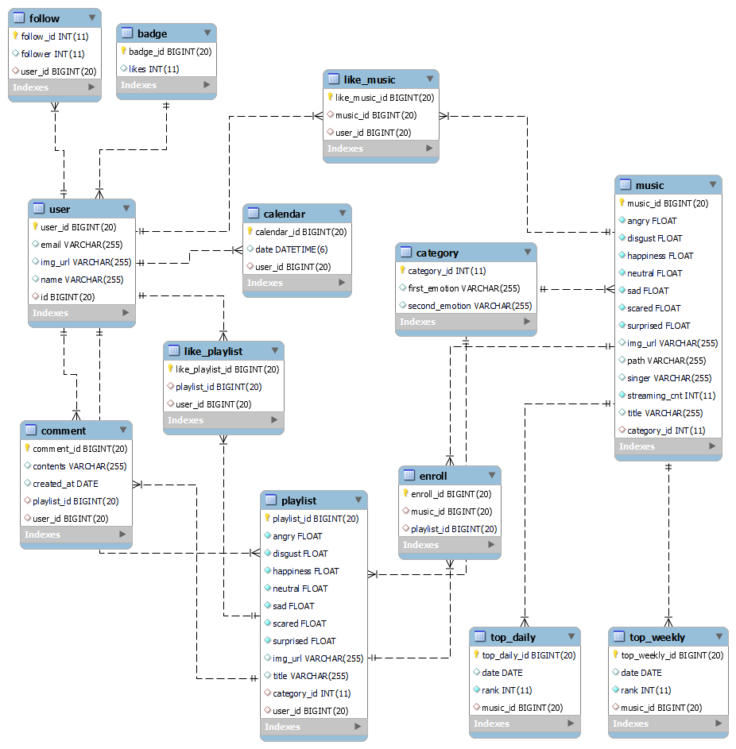
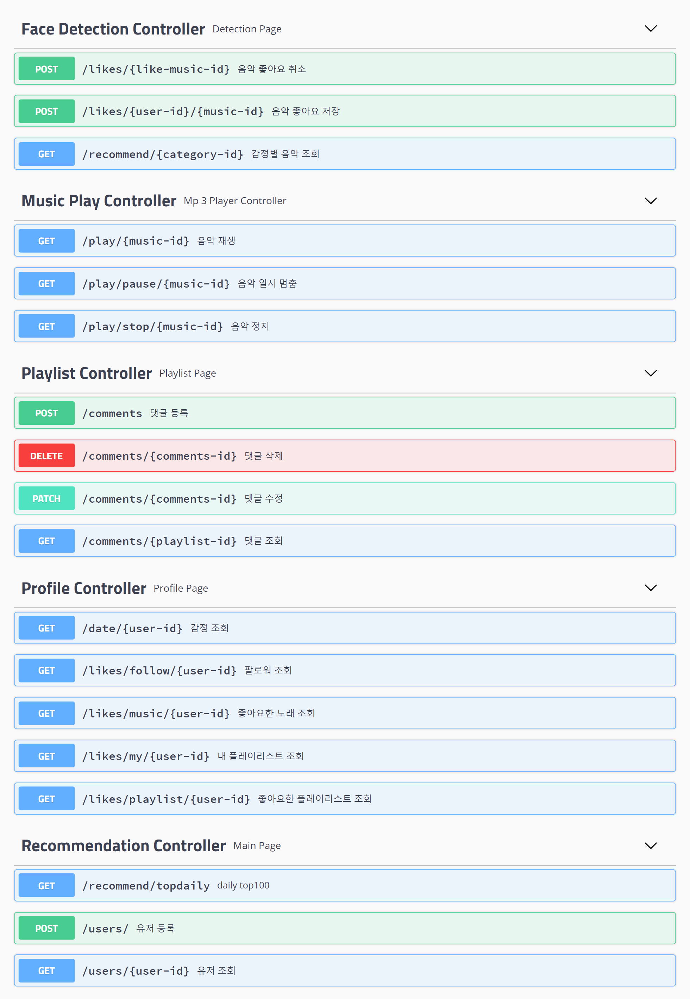

# 뮤랑이(Mu-rang-E)
 **: 실시간 표정 인식 기반 음악 추천 웹사이트**

- [팀 노션 페이지](https://www.notion.so/Mu-rang-E-7f27831660944722ab52bddffee156fa)
- [페이지별 기능 명세](https://www.notion.so/8d102795685049f6b4c82b2804ea80f1)

## 목차
1. [서비스 구조도](#1.-서비스-구조도)
2. [페이지 기획 & UI 설계](#2.-페이지-기획-&-UI-디자인)
3. [DB 설계](#3.-DB-설계)
3. [API 설계](#4.-API-설계)

## 1. 서비스 구조도

(추가예정)

## 2. 페이지 기획 & UI 디자인

- [페이지 기획(Whimsical)](https://whimsical.com/mu-rang-e-ui-ux-W8eSUqt6YVZwtEMDd8TAZk)
- [UI 설계(Figma)](https://www.figma.com/file/XwR1kwDMdNgHwesY5C0jMs/%EB%AE%A4%EB%9E%91%EC%9D%B4(Mu-rang_E)?node-id=0%3A1)

## 3. DB 설계
- [DB 설계 명세서](https://github.com/2022-project/MurnagE/issues/1)

## 4. API 설계
- [API 설계 명세서(노션)](https://www.notion.so/API-ed240b43b77249d3bf473ce0441f0d7a)

